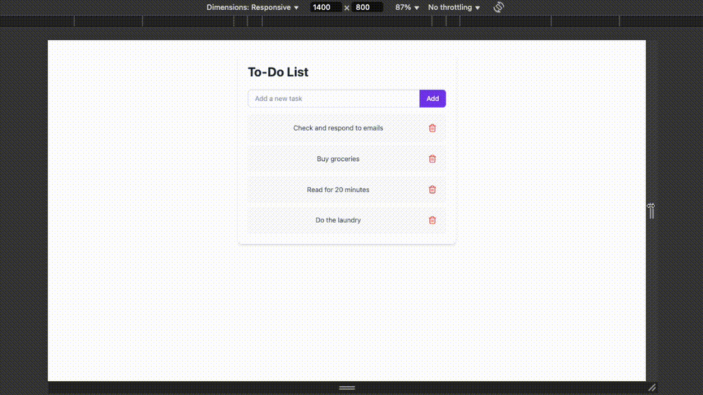
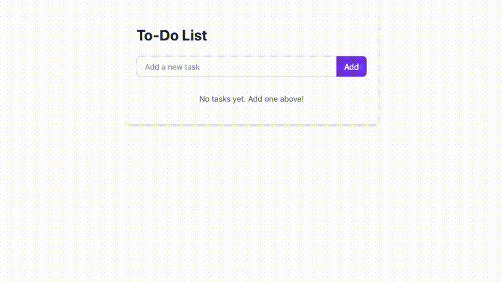

# 📝 React To-Do App

A minimal to-do list app built with React and Vite.
Users can add tasks using an input field and "Add" button, and delete them by clicking the remove icon.

## Table of contents

- [Overview](#overview)
  - [Features](#features)
  - [Screenshot](#screenshot)
- [Getting Started](#getting-started)
    - [Docker](#docker)
    - [Testing](#testing)
- [Future Improvements](#future-improvements)

## 🌟 Overview

### Features

- Add new tasks
- Delete existing tasks
- Docker support for deployment
- Unit testing with Vitest

### Screenshot

-  **Responsiveness**:

    The app layout adjusts smoothly across screen sizes.

    

- **User interactions**

    Demonstrating task addition and removal in real time.

    


## 🚀 Getting Started

To get a local copy of the project up and running, follow these simple steps.

1. Clone the repo:

```bash
git clone https://github.com/rainof/todo-test
```

2. Install dependencies:

```bash
npm install
```

3. Run the app in development mode:

```bash
npm run dev
```

## 🐳 Docker

Ensure Docker is installed on your machine.
Then, to build and run the app with Docker:

```bash
docker build -t react-todo-app .
docker run -p 8080:80 react-todo-app
```

Access the app at http://localhost:8080.

## 🧪 Testing

This app uses [Vitest](https://vitest.dev/) for unit testing.

To run tests:

```bash
npm run test
```

## 💡 Future Improvements

✅ Add a checkbox to mark tasks as completed

🕒 Show timestamp for when tasks are added

📅 Allow setting a deadline for each task

🔀 Sort tasks by deadline

🧭 Add filters (e.g., All, Completed, Pending)

✏️ Edit existing tasks

💾 Save tasks to local storage or a backend